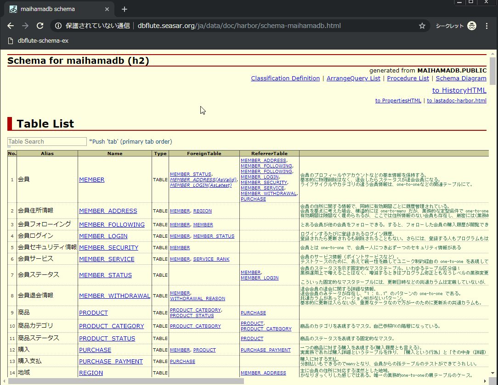

## Demo

### Install

1. Open [dist/bookmarklet.txt](https://raw.githubusercontent.com/arx-8/dbflute-schema-ex/master/dist/bookmarklet.txt)
   - Please don't worry! This is just a (very long) bookmarklet script.
2. Copy all text
3. Register as a bookmark
   - Ref. [ブックマークレットの登録方法 - Qiita](https://qiita.com/aqril_1132/items/b5f9040ccb8cbc705d04)
4. Have a good development!

### Uninstall

1. Just delete bookmarklet.

### Schema html official sample

<http://dbflute.seasar.org/ja/data/doc/harbor/schema-maihamadb.html>

## For developer

### Installation & Build

1. npm i
2. npm run build

### UnitTest

`npm test`

### Type Check & ESLint & Automatically fix problems

`npm run lint`

### Recommended IDE

Visual Studio Code

## Ref.

- <https://github.com/Microsoft/TypeScript-Babel-Starter>
- <https://github.com/a-tarasyuk/webpack-typescript-babel>
- <https://teppeis.hatenablog.com/entry/2019/02/typescript-eslint>
